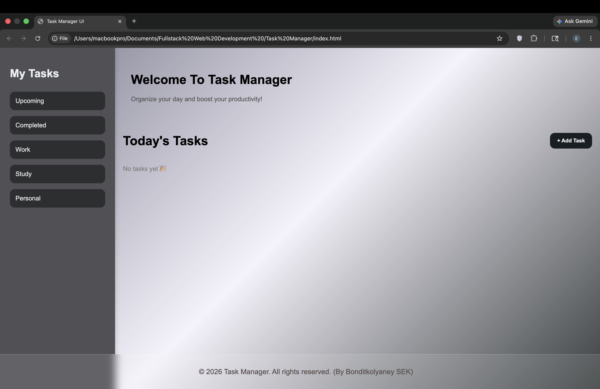

# 📝 Task Manager App

A simple but powerful task management web application built using **HTML, CSS, and JavaScript**.  
It allows users to create, edit, delete, and filter tasks with a clean UI and local storage support.

---

## 🚀 Live Demo
👉 https://github.com/bonditkolyaneysek/task-manager.git

---

## 📸 Preview

---

## ✨ Features

- ➕ Add new tasks
- 📝 Edit task title
- ❌ Delete tasks
- ✔ Mark tasks as completed
- 📂 Filter tasks (Upcoming / Completed / Work / Study / Personal)
- 💾 Save tasks using Local Storage
- 📱 Responsive mobile sidebar menu
- 🎨 Clean modern UI

---

## 🛠️ Built With

- HTML5
- CSS3
- JavaScript (Vanilla JS)
- LocalStorage API

---

## 📂 Project Structure
index.html
style.css
script.js

---

## 🧠 What I Learned

- DOM manipulation
- Event handling
- Array data management
- Local storage usage
- UI state management
- Responsive design

---

## 🚀 How to Run Locally

1. Clone the repository:
git clone https://github.com/bonditkolyaneysek/task-manager.git

2. Open `index.html` in your browser

---

## 📌 Future Improvements

- Drag & drop tasks
- Dark mode
- Due dates
- Task categories with colors
- Backend database support

---

## 👤 Author

- GitHub: https://github.com/bonditkolyaneysek/task-manager.git

---

## ⭐ If you like this project

Give it a star ⭐ and feel free to fork it!
